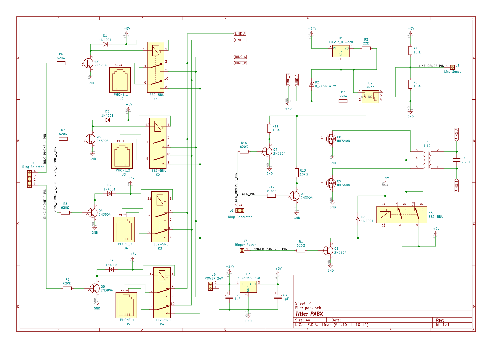

# Multi-Line Telephone Intercom

When my kids found some old rotary phones and inspired by [this](https://www.youtube.com/watch?v=BGbmFF56iH8) video I ended up building a very crude PABX.

## Setup

Decided to give purpose to one of my Rasberry Pi's that was laying around to:
* detect dial pulses,
* generate ~20Hz to drive ringer circuit.

In my setup I'm using _Raspberry Pi Model B Rev 1_ but probably pretty much any hardware with enough GPIOs would do. In order to operate 4 phones, 8 rpi's GPIOs are used.

### GPIO Mappings

Communication with GPIOs is done using the [wiring Pi](http://wiringpi.com/download-and-install/) library. [Mappings](http://wiringpi.com/pins/) of pins for Raspberry Pi Model B Rev 1 header:

```
+-----+-----+---------+------+---+-Model B1-+---+------+---------+-----+-----+
 | BCM | wPi |   Name  | Mode | V | Physical | V | Mode | Name    | wPi | BCM |
 +-----+-----+---------+------+---+----++----+---+------+---------+-----+-----+
 |     |     |    3.3v |      |   |  1 || 2  |   |      | 5v      |     |     |
 |   0 |   8 |   SDA.1 |   IN | 1 |  3 || 4  |   |      | 5v      |     |     |
 |   1 |   9 |   SCL.1 |   IN | 1 |  5 || 6  |   |      | 0v      |     |     |
 |   4 |   7 | GPIO. 7 |   IN | 1 |  7 || 8  | 1 | ALT0 | TxD     | 15  | 14  |
 |     |     |      0v |      |   |  9 || 10 | 1 | ALT0 | RxD     | 16  | 15  |
 |  17 |   0 | GPIO. 0 |  OUT | 0 | 11 || 12 | 0 | OUT  | GPIO. 1 | 1   | 18  |
 |  21 |   2 | GPIO. 2 |  OUT | 0 | 13 || 14 |   |      | 0v      |     |     |
 |  22 |   3 | GPIO. 3 |  OUT | 0 | 15 || 16 | 1 | IN   | GPIO. 4 | 4   | 23  |
 |     |     |    3.3v |      |   | 17 || 18 | 0 | OUT  | GPIO. 5 | 5   | 24  |
 |  10 |  12 |    MOSI |  OUT | 0 | 19 || 20 |   |      | 0v      |     |     |
 |   9 |  13 |    MISO |  OUT | 0 | 21 || 22 | 0 | IN   | GPIO. 6 | 6   | 25  |
 |  11 |  14 |    SCLK |   IN | 0 | 23 || 24 | 1 | IN   | CE0     | 10  | 8   |
 |     |     |      0v |      |   | 25 || 26 | 1 | IN   | CE1     | 11  | 7   |
 +-----+-----+---------+------+---+----++----+---+------+---------+-----+-----+
 | BCM | wPi |   Name  | Mode | V | Physical | V | Mode | Name    | wPi | BCM |
 +-----+-----+---------+------+---+-Model B1-+---+------+---------+-----+-----+
 ```

where

##### Ring Selector (which phone should ring) pins:

| wiring Pi #  | Physical Pin |
| ------------- | ------------- |
| 0             | 11            |
| 1             | 12            |
| 2             | 13            |
| 3             | 15            |

##### Sense (detects off-hook and dial pulses) pin:

| wiring Pi #  | Physical Pin |
| ------------- | ------------- |
| 4             | 16            |

##### Ringer Circuit Power (turns ringer circuit on/off) pin:

| wiring Pi #  | Physical Pin |
| ------------- | ------------- |
| 5             | 18            |

##### Ring Generator (generates ~20Hz for phone ringer) pins:

| wiring Pi #  | Physical Pin |
| ------------- | ------------- |
| 12            | 19            |
| 13            | 21            |

Above GPIOs are connected, as marked on circuit:

#### Circuit



### Finally

When circuit is assembled and RPI connected, one can build the source code - a simle `make` should do the trick.

When code is started and everthing is connected/assembled properly, the following phone numbers should make a phone ring:

| Phone Number  | Phone |
| ------------- | ----- |
| 22            | 1     |
| 24            | 2     |
| 26            | 3     |
| 28            | 4     |

So dialing `2` and `4` should make a phone connected to `PHONE_2` ring.

Since circuit does not prevent generating ring to a phone with off-hook - i.e. dialing `22` on a phone connected to `PHONE_1`, ringer circuit is only active for about ~2.5s. Also, last numbers 2/4/6/8 are (hopefully) making it harder to miss-dial.

### Next Steps

It was fun building this - and since "newer" DTMF capable phones usually can be switched to generate pulse dailing - pretty much all phones can be used with above setup.

Besides calling each other within the house (which is fun and saves some stair-trips), I'm planning to add support for MQTT (or similar) - imagine dialing `99` which would then turn all the lights off in the house. Pretty easy to do with this in place - just need to connect to [openHAB](https://www.openhab.org/) (or some other smarthouse app, it's just that I'm using OH) and send a MQTT message with `99` payload and configure OH that `99` should turn all the lights off ...


